# Design Document: Transaction Settlement Consistency

## Overview

Este documento descreve o design da solução para padronizar e garantir a consistência do sistema de acertos (settlements) de transações compartilhadas. A solução implementa bloqueios de edição, exclusão e antecipação em transações acertadas, adiciona funcionalidade de antecipação de parcelas na página de compartilhados, e garante integridade financeira através de validações robustas.

### Problema Atual

O sistema tem dois problemas principais:

**1. Falta de Integração entre Compartilhados e Transações:**
- Transações compartilhadas aparecem desconectadas na lista de transações normais
- Mudanças em compartilhados não refletem automaticamente nas transações
- Exclusões não têm efeito cascata adequado entre os sistemas
- Falta padronização visual e comportamental entre as páginas

**2. Operações Destrutivas em Transações Acertadas:**
- Transações de CRÉDITO (recebidas) podem ser editadas mesmo após marcadas como pagas
- Transações acertadas podem ser excluídas, causando perda de histórico
- Parcelas acertadas podem ser antecipadas, gerando inconsistências
- Falta funcionalidade de antecipação de parcelas na página de compartilhados
- Não há validação de estado antes de operações críticas

### Solução Proposta

Implementar um sistema integrado que:

**1. Integração Completa entre Compartilhados e Transações:**
- Transações compartilhadas devem aparecer consistentemente em todas as páginas
- Mudanças em compartilhados devem refletir automaticamente nas transações
- Exclusões devem ter efeito cascata completo (compartilhados → transações → splits)
- Padronização visual e comportamental entre páginas

**2. Validação de Estado e Bloqueios:**
- Verifica o status de settlement antes de qualquer operação
- Bloqueia operações destrutivas em transações acertadas
- Fornece feedback claro ao usuário sobre por que operações foram bloqueadas
- Adiciona funcionalidade de antecipação de parcelas
- Garante integridade financeira através de transações atômicas

**3. Sincronização Bidirecional:**
- Ações em Compartilhados → Refletem em Transações
- Ações em Transações → Refletem em Compartilhados
- Estado de acerto sincronizado em tempo real
- Cache invalidation automática

## Architecture

### Camadas da Aplicação

```
┌─────────────────────────────────────────────────────────────┐
│                      UI Layer                                │
│  - SharedExpenses.tsx (Página de Compartilhados)            │
│  - Transactions.tsx (Lista de Transações)                   │
│  - TransactionModal.tsx                                      │
│  - AnticipateInstallmentsDialog.tsx (NEW)                   │
│  - SharedTransactionBadge.tsx (NEW - Badge visual)          │
└─────────────────────────────────────────────────────────────┘
                            │
                            ▼
┌─────────────────────────────────────────────────────────────┐
│              Synchronization Layer (NEW)                     │
│  - useTransactionSync.ts                                     │
│  - syncSharedTransactions()                                  │
│  - invalidateRelatedQueries()                                │
└─────────────────────────────────────────────────────────────┘
                            │
                            ▼
┌─────────────────────────────────────────────────────────────┐
│                   Validation Layer (NEW)                     │
│  - useTransactionValidation.ts                               │
│  - settlementValidation.ts                                   │
└─────────────────────────────────────────────────────────────┘
                            │
                            ▼
┌─────────────────────────────────────────────────────────────┐
│                    Business Logic Layer                      │
│  - useSharedFinances.ts (UPDATED)                           │
│  - useTransactions.ts (UPDATED)                             │
│  - useAnticipateInstallments.ts (NEW)                       │
└─────────────────────────────────────────────────────────────┘
                            │
                            ▼
┌─────────────────────────────────────────────────────────────┐
│                      Data Layer                              │
│  - Supabase Client                                           │
│  - Database Functions (RPC)                                  │
│  - Cascade Delete Triggers                                   │
└─────────────────────────────────────────────────────────────┘
```

### Fluxo de Integração Compartilhados ↔ Transações

```mermaid
graph TD
    A[Ação em Compartilhados] --> B[Atualizar Transação]
    B --> C[Invalidar Cache]
    C --> D[Refetch Compartilhados]
    C --> E[Refetch Transações]
    D --> F[UI Atualizada]
    E --> F
    
    G[Ação em Transações] --> H{É Compartilhada?}
    H -->|Sim| I[Atualizar Splits]
    H -->|Não| J[Operação Normal]
    I --> C
    J --> K[UI Atualizada]
```



## Components and Interfaces

### 1. Transaction Synchronization Hook (NEW)

**File:** `src/hooks/useTransactionSync.ts`

```typescript
export interface TransactionSyncResult {
  syncTransaction: (transactionId: string) => Promise<void>;
  syncAllShared: () => Promise<void>;
  invalidateRelated: (transactionId: string) => Promise<void>;
  isSyncing: boolean;
}

/**
 * Hook para sincronizar transações compartilhadas entre páginas
 * Garante que mudanças em Compartilhados refletem em Transações e vice-versa
 */
export function useTransactionSync(): TransactionSyncResult;
```

### 2. Shared Transaction Badge Component (NEW)

**File:** `src/components/shared/SharedTransactionBadge.tsx`

```typescript
export interface SharedTransactionBadgeProps {
  isShared: boolean;
  isSettled: boolean;
  type: 'CREDIT' | 'DEBIT';
  memberName?: string;
  compact?: boolean;
}

/**
 * Badge visual para identificar transações compartilhadas
 * Aparece tanto em Compartilhados quanto em Transações
 */
export function SharedTransactionBadge(
  props: SharedTransactionBadgeProps
): JSX.Element;
```

### 3. Settlement Validation Service

**File:** `src/services/settlementValidation.ts`

```typescript
export interface SettlementStatus {
  isSettled: boolean;
  settledBy: 'debtor' | 'creditor' | 'both' | 'none';
  canEdit: boolean;
  canDelete: boolean;
  canAnticipate: boolean;
  blockReason?: string;
}

export interface ValidationResult {
  isValid: boolean;
  error?: {
    code: string;
    message: string;
    action?: string; // Suggested action for user
  };
}

export class SettlementValidator {
  /**
   * Check if a transaction can be edited
   */
  static canEdit(transaction: Transaction, split?: TransactionSplit): ValidationResult;
  
  /**
   * Check if a transaction can be deleted
   */
  static canDelete(transaction: Transaction, splits?: TransactionSplit[]): ValidationResult;
  
  /**
   * Check if an installment can be anticipated
   */
  static canAnticipate(transaction: Transaction, split?: TransactionSplit): ValidationResult;
  
  /**
   * Check if a series can be deleted
   */
  static canDeleteSeries(seriesId: string, transactions: Transaction[]): ValidationResult;
  
  /**
   * Get settlement status for a transaction
   */
  static getSettlementStatus(transaction: Transaction, split?: TransactionSplit): SettlementStatus;
}
```

### 4. Transaction Validation Hook

**File:** `src/hooks/useTransactionValidation.ts`

```typescript
export interface UseTransactionValidationProps {
  transactionId?: string;
  splitId?: string;
}

export interface TransactionValidationResult {
  canEdit: boolean;
  canDelete: boolean;
  canAnticipate: boolean;
  settlementStatus: SettlementStatus;
  validate: (operation: 'edit' | 'delete' | 'anticipate') => ValidationResult;
}

export function useTransactionValidation(
  props: UseTransactionValidationProps
): TransactionValidationResult;
```

### 5. Anticipate Installments Hook

**File:** `src/hooks/useAnticipateInstallments.ts`

```typescript
export interface AnticipateInstallmentsParams {
  seriesId: string;
  installmentIds: string[];
  targetDate: Date;
}

export interface AnticipateInstallmentsResult {
  anticipate: (params: AnticipateInstallmentsParams) => Promise<void>;
  isLoading: boolean;
  error: Error | null;
}

export function useAnticipateInstallments(): AnticipateInstallmentsResult;
```

### 6. Anticipate Installments Dialog Component

**File:** `src/components/dialogs/AnticipateInstallmentsDialog.tsx`

```typescript
export interface AnticipateInstallmentsDialogProps {
  isOpen: boolean;
  onClose: () => void;
  seriesId: string;
  currentInstallment: number;
  totalInstallments: number;
  onSuccess: () => void;
}

export function AnticipateInstallmentsDialog(
  props: AnticipateInstallmentsDialogProps
): JSX.Element;
```

### 7. Updated InvoiceItem Interface

**File:** `src/hooks/useSharedFinances.ts` (UPDATED)

```typescript
export interface InvoiceItem {
  // ... existing fields ...
  
  // NEW: Settlement status fields
  isSettled: boolean;
  settledByDebtor: boolean;
  settledByCreditor: boolean;
  
  // NEW: Validation flags
  canEdit: boolean;
  canDelete: boolean;
  canAnticipate: boolean;
  
  // NEW: Block reason (if operation is blocked)
  blockReason?: string;
}
```

### 8. Updated Transaction Interface

**File:** `src/types/transaction.ts` (UPDATED)

```typescript
export interface Transaction {
  // ... existing fields ...
  
  // NEW: Shared transaction metadata
  is_shared: boolean;
  is_settled: boolean;
  settled_at?: string;
  
  // NEW: Validation metadata (computed)
  _canEdit?: boolean;
  _canDelete?: boolean;
  _canAnticipate?: boolean;
  _settlementStatus?: SettlementStatus;
}
```

## Data Models

### Visual Integration Strategy

Para garantir que transações compartilhadas apareçam consistentemente em todas as páginas:

**1. Badge Visual Unificado:**
```typescript
// Aparece em TODAS as páginas onde a transação é exibida
<SharedTransactionBadge 
  isShared={true}
  isSettled={transaction.is_settled}
  type={transaction.type === 'CREDIT' ? 'CREDIT' : 'DEBIT'}
  memberName={memberName}
/>
```

**2. Indicadores de Estado:**
- 🟢 Verde: CRÉDITO (você recebe)
- 🔴 Vermelho: DÉBITO (você deve)
- ✅ PAGO badge: Transação acertada
- 👥 Compartilhado badge: Transação compartilhada

**3. Comportamento Consistente:**
- Transações acertadas: Mesmas restrições em todas as páginas
- Dropdown menu: Mesmas opções disponíveis
- Visual styling: Mesma aparência (opacity, strikethrough, etc.)

### Database Schema (Existing - No Changes Required)

```sql
-- transaction_splits table (existing)
CREATE TABLE transaction_splits (
  id UUID PRIMARY KEY,
  transaction_id UUID REFERENCES transactions(id) ON DELETE CASCADE,
  user_id UUID REFERENCES auth.users(id),
  member_id UUID REFERENCES family_members(id),
  amount DECIMAL(10, 2),
  is_settled BOOLEAN DEFAULT FALSE,
  settled_by_debtor BOOLEAN DEFAULT FALSE,
  settled_by_creditor BOOLEAN DEFAULT FALSE,
  debtor_settlement_tx_id UUID REFERENCES transactions(id),
  creditor_settlement_tx_id UUID REFERENCES transactions(id),
  settled_at TIMESTAMP,
  created_at TIMESTAMP DEFAULT NOW()
);

-- transactions table (existing)
CREATE TABLE transactions (
  id UUID PRIMARY KEY,
  user_id UUID REFERENCES auth.users(id),
  description TEXT,
  amount DECIMAL(10, 2),
  date DATE,
  competence_date DATE,
  type TEXT CHECK (type IN ('INCOME', 'EXPENSE')),
  is_shared BOOLEAN DEFAULT FALSE,
  is_settled BOOLEAN DEFAULT FALSE,
  settled_at TIMESTAMP,
  series_id UUID,
  current_installment INTEGER,
  total_installments INTEGER,
  -- ... other fields ...
);
```

### New Database Function: validate_transaction_operation

```sql
CREATE OR REPLACE FUNCTION validate_transaction_operation(
  p_transaction_id UUID,
  p_operation TEXT, -- 'edit', 'delete', 'anticipate'
  p_user_id UUID
)
RETURNS JSONB
LANGUAGE plpgsql
AS $$
DECLARE
  v_transaction RECORD;
  v_splits RECORD[];
  v_result JSONB;
BEGIN
  -- Get transaction
  SELECT * INTO v_transaction
  FROM transactions
  WHERE id = p_transaction_id;
  
  IF NOT FOUND THEN
    RETURN jsonb_build_object(
      'isValid', false,
      'error', jsonb_build_object(
        'code', 'TRANSACTION_NOT_FOUND',
        'message', 'Transação não encontrada'
      )
    );
  END IF;
  
  -- Get splits
  SELECT array_agg(row_to_json(s.*)) INTO v_splits
  FROM transaction_splits s
  WHERE s.transaction_id = p_transaction_id;
  
  -- Check settlement status
  IF v_transaction.is_settled OR 
     EXISTS (
       SELECT 1 FROM transaction_splits
       WHERE transaction_id = p_transaction_id
       AND (settled_by_debtor = true OR settled_by_creditor = true)
     ) THEN
    
    RETURN jsonb_build_object(
      'isValid', false,
      'error', jsonb_build_object(
        'code', 'TRANSACTION_SETTLED',
        'message', 'Esta transação já foi acertada e não pode ser modificada',
        'action', 'Desfaça o acerto primeiro para poder editar'
      )
    );
  END IF;
  
  -- Check permissions
  IF v_transaction.user_id != p_user_id THEN
    RETURN jsonb_build_object(
      'isValid', false,
      'error', jsonb_build_object(
        'code', 'NO_PERMISSION',
        'message', 'Apenas o criador da transação pode realizar esta operação'
      )
    );
  END IF;
  
  -- Operation is valid
  RETURN jsonb_build_object('isValid', true);
END;
$$;
```

## Correctness Properties

*A property is a characteristic or behavior that should hold true across all valid executions of a system-essentially, a formal statement about what the system should do. Properties serve as the bridge between human-readable specifications and machine-verifiable correctness guarantees.*


### Property Reflection

Após análise dos critérios de aceitação, identifiquei as seguintes redundâncias:
- Critério 3.2 é redundante com 3.1 (ambos testam filtragem de parcelas acertadas)
- Critério 8.2 é redundante com 1.1 (ambos testam bloqueio de edição)
- Critério 9.3 é redundante com 2.4 (ambos testam listagem de parcelas acertadas)

Essas redundâncias serão eliminadas nas propriedades finais.

### Correctness Properties

Property 1: Settled transactions cannot be edited
*For any* transaction where is_settled = true OR settled_by_debtor = true OR settled_by_creditor = true, attempting to edit that transaction should be blocked and return an error
**Validates: Requirements 1.1, 8.2**

Property 2: Edit attempts on settled transactions show clear error
*For any* settled transaction, when an edit is attempted, the system should display an error message explaining that settled transactions cannot be edited
**Validates: Requirements 1.2**

Property 3: Settled CREDIT transactions hide edit UI
*For any* CREDIT transaction that is settled, the UI should hide or disable all edit buttons and options
**Validates: Requirements 1.3**

Property 4: Settled DEBIT transactions hide edit UI
*For any* DEBIT transaction that is settled, the UI should hide or disable all edit buttons and options
**Validates: Requirements 1.4**

Property 5: Settled transactions display PAGO badge
*For any* settled transaction, the UI should display it with a "PAGO" badge visible
**Validates: Requirements 1.5, 6.1**

Property 6: Settled transactions cannot be deleted
*For any* transaction where is_settled = true OR any split has settled_by_debtor = true OR settled_by_creditor = true, attempting to delete that transaction should be blocked
**Validates: Requirements 2.1**

Property 7: Delete attempts on settled transactions show error with undo suggestion
*For any* settled transaction, when deletion is attempted, the system should display an error message requiring the user to undo the settlement first
**Validates: Requirements 2.2**

Property 8: Series with settled installments cannot be deleted
*For any* installment series where at least one installment is settled, attempting to delete the entire series should be blocked
**Validates: Requirements 2.3**

Property 9: Non-settled series can be deleted
*For any* installment series where all installments are not settled, the system should allow deletion of the entire series
**Validates: Requirements 2.5**

Property 10: Settled installments excluded from anticipation list
*For any* settled installment, it should not appear in the list of installments available for anticipation
**Validates: Requirements 3.1, 3.2**

Property 11: API blocks anticipation of settled installments
*For any* settled installment, API calls to anticipate that installment should return an error preventing the operation
**Validates: Requirements 3.4**

Property 12: Non-settled installment transactions show anticipation option
*For any* installment transaction that is not settled in the shared expenses page, the dropdown menu should display an "Antecipar Parcelas" option
**Validates: Requirements 4.1**

Property 13: Anticipation updates competence_date correctly
*For any* anticipation operation on selected installments, the competence_date should be updated to the target month while transaction_date remains unchanged
**Validates: Requirements 4.3, 4.4**

Property 14: Edit operations validate settlement status first
*For any* edit operation attempt, the system should check the settlement status before proceeding with the edit
**Validates: Requirements 5.1**

Property 15: Delete operations validate settlement status first
*For any* delete operation attempt, the system should check the settlement status of all affected transactions before proceeding
**Validates: Requirements 5.2**

Property 16: Anticipation operations validate settlement status first
*For any* anticipation operation attempt, the system should verify that target installments are not settled before proceeding
**Validates: Requirements 5.3**

Property 17: Failed validations return specific error codes
*For any* validation that fails, the system should return a specific error code and descriptive message
**Validates: Requirements 5.4**

Property 18: Successful validations proceed and log
*For any* validation that passes, the system should proceed with the operation and log the action
**Validates: Requirements 5.5**

Property 19: Settled transactions have consistent visual styling
*For any* settled transaction, the UI should apply: reduced opacity (60%), CheckCircle icon, strikethrough description text, and only show "Desfazer acerto" in dropdown menu
**Validates: Requirements 6.2, 6.3, 6.4, 6.5**

Property 20: Undo settlement deletes settlement transaction
*For any* undo settlement operation, the system should delete the associated settlement transaction
**Validates: Requirements 7.1**

Property 21: Undo settlement resets split flags
*For any* undo settlement operation, the system should update the split flags (settled_by_debtor or settled_by_creditor) to false
**Validates: Requirements 7.2**

Property 22: Undo settlement recalculates is_settled flag
*For any* undo settlement operation, the system should recalculate the is_settled flag based on remaining settlements
**Validates: Requirements 7.3**

Property 23: Undo settlement restores editability
*For any* undo settlement operation, the original transaction should become editable again
**Validates: Requirements 7.4**

Property 24: Settlement creation checks for duplicates
*For any* settlement creation attempt, the system should verify that no settlement transaction already exists for that split
**Validates: Requirements 8.1**

Property 25: Transaction deletion cascades to related data
*For any* transaction deletion, the system should cascade delete all related splits and settlement transactions
**Validates: Requirements 8.3**

Property 26: Anticipation prevents duplicate competence_date entries
*For any* anticipation operation, the system should verify that no duplicate competence_date entries are created for the same series
**Validates: Requirements 8.4**

Property 27: Blocked operations display explanatory messages
*For any* operation blocked by settlement status, the system should display a message explaining why the operation was blocked
**Validates: Requirements 9.1**

Property 28: Validation errors display as toast notifications
*For any* validation error, the system should display the error in a toast notification with appropriate styling
**Validates: Requirements 9.5**

Property 29: Settlement operations are logged
*For any* settlement creation or undo operation, the system should log the user_id, timestamp, amount, and affected split_id
**Validates: Requirements 10.1, 10.2**

Property 30: Blocked operations are logged
*For any* blocked operation, the system should log the attempted operation and reason for blocking
**Validates: Requirements 10.3**

Property 31: Log queries support filtering
*For any* log query, the system should provide filtering by user, date range, and operation type
**Validates: Requirements 10.5**

## Error Handling

### Error Codes and Messages

```typescript
export enum SettlementErrorCode {
  TRANSACTION_SETTLED = 'TRANSACTION_SETTLED',
  TRANSACTION_NOT_FOUND = 'TRANSACTION_NOT_FOUND',
  NO_PERMISSION = 'NO_PERMISSION',
  SERIES_HAS_SETTLED_INSTALLMENTS = 'SERIES_HAS_SETTLED_INSTALLMENTS',
  INSTALLMENT_SETTLED = 'INSTALLMENT_SETTLED',
  DUPLICATE_SETTLEMENT = 'DUPLICATE_SETTLEMENT',
  INVALID_OPERATION = 'INVALID_OPERATION',
}

export const ERROR_MESSAGES: Record<SettlementErrorCode, { message: string; action?: string }> = {
  [SettlementErrorCode.TRANSACTION_SETTLED]: {
    message: 'Esta transação já foi acertada e não pode ser modificada',
    action: 'Desfaça o acerto primeiro para poder editar',
  },
  [SettlementErrorCode.TRANSACTION_NOT_FOUND]: {
    message: 'Transação não encontrada',
  },
  [SettlementErrorCode.NO_PERMISSION]: {
    message: 'Apenas o criador da transação pode realizar esta operação',
  },
  [SettlementErrorCode.SERIES_HAS_SETTLED_INSTALLMENTS]: {
    message: 'Esta série contém parcelas já acertadas',
    action: 'Desfaça os acertos das parcelas antes de excluir a série',
  },
  [SettlementErrorCode.INSTALLMENT_SETTLED]: {
    message: 'Parcelas acertadas não podem ser antecipadas',
    action: 'Desfaça o acerto primeiro para poder antecipar',
  },
  [SettlementErrorCode.DUPLICATE_SETTLEMENT]: {
    message: 'Já existe um acerto para esta transação',
  },
  [SettlementErrorCode.INVALID_OPERATION]: {
    message: 'Operação inválida',
  },
};
```

### Error Handling Flow

```typescript
// Example: Handling edit operation
try {
  const validation = SettlementValidator.canEdit(transaction, split);
  
  if (!validation.isValid) {
    const errorInfo = ERROR_MESSAGES[validation.error.code];
    toast.error(errorInfo.message);
    
    if (errorInfo.action) {
      toast.info(errorInfo.action, { duration: 5000 });
    }
    
    return;
  }
  
  // Proceed with edit
  await updateTransaction(transaction);
  toast.success('Transação atualizada com sucesso!');
  
} catch (error) {
  console.error('Error updating transaction:', error);
  toast.error('Erro ao atualizar transação');
}
```

## Testing Strategy

### Dual Testing Approach

This feature requires both unit tests and property-based tests:

**Unit Tests:**
- Test specific error messages and codes
- Test UI component rendering for settled vs non-settled states
- Test dialog interactions (open, close, submit)
- Test edge cases (empty series, all settled, none settled)

**Property-Based Tests:**
- Test validation logic across all possible settlement states
- Test that settled transactions are always blocked from edit/delete/anticipate
- Test that undo operations always restore correct state
- Test that cascade deletes always clean up related data
- Test that anticipation never modifies transaction_date

### Property-Based Testing Configuration

- **Library:** fast-check (for TypeScript/JavaScript)
- **Minimum iterations:** 100 per property test
- **Tag format:** `Feature: transaction-settlement-consistency, Property {number}: {property_text}`

### Test Organization

```
src/
  __tests__/
    services/
      settlementValidation.test.ts (unit + property tests)
    hooks/
      useTransactionValidation.test.ts (unit tests)
      useAnticipateInstallments.test.ts (unit tests)
    components/
      AnticipateInstallmentsDialog.test.tsx (unit tests)
    integration/
      settlementFlow.property.test.ts (property tests)
```

### Example Property Test

```typescript
import fc from 'fast-check';
import { SettlementValidator } from '@/services/settlementValidation';

describe('Feature: transaction-settlement-consistency, Property 1: Settled transactions cannot be edited', () => {
  it('should block edit operations on any settled transaction', () => {
    fc.assert(
      fc.property(
        // Generate arbitrary transactions with various settlement states
        fc.record({
          id: fc.uuid(),
          is_settled: fc.boolean(),
          settled_by_debtor: fc.boolean(),
          settled_by_creditor: fc.boolean(),
          // ... other fields
        }),
        (transaction) => {
          // If any settlement flag is true, edit should be blocked
          const isSettled = transaction.is_settled || 
                           transaction.settled_by_debtor || 
                           transaction.settled_by_creditor;
          
          const result = SettlementValidator.canEdit(transaction);
          
          if (isSettled) {
            expect(result.isValid).toBe(false);
            expect(result.error?.code).toBe('TRANSACTION_SETTLED');
          }
        }
      ),
      { numRuns: 100 }
    );
  });
});
```

## Implementation Notes

### Phase 1: Validation Layer
1. Create `settlementValidation.ts` service
2. Implement all validation functions
3. Add comprehensive unit tests
4. Add property-based tests for validation logic

### Phase 2: Hooks and State Management
1. Create `useTransactionValidation.ts` hook
2. Update `useSharedFinances.ts` to include validation flags in InvoiceItem
3. Create `useAnticipateInstallments.ts` hook
4. Add tests for all hooks

### Phase 3: UI Components
1. Update `SharedExpenses.tsx` to use validation flags
2. Create `AnticipateInstallmentsDialog.tsx` component
3. Update dropdown menus to conditionally show options
4. Add visual styling for settled transactions
5. Add component tests

### Phase 4: Database Functions
1. Create `validate_transaction_operation` function
2. Add database-level validation
3. Test database functions

### Phase 5: Integration and Testing
1. Integration tests for complete flows
2. Property-based tests for end-to-end scenarios
3. Manual testing with real data
4. Performance testing

### Rollback Plan

If issues are discovered:
1. Feature flag can disable new validation (allow old behavior)
2. Database function can be dropped without affecting existing data
3. UI changes are purely additive (no data migration needed)
4. Validation layer can be bypassed in emergency

### Performance Considerations

- Validation checks are O(1) operations (simple flag checks)
- Database function uses indexed columns (transaction_id, is_settled)
- UI updates are optimistic (validate before API call)
- Caching of validation results in React Query

### Security Considerations

- All validation happens on both client and server
- User permissions checked before any operation
- Audit logs cannot be modified by users
- Settlement transactions are immutable once created

## Conclusion

This design provides a comprehensive solution for transaction settlement consistency. The validation layer ensures that settled transactions cannot be modified, while clear error messages guide users on how to proceed. The addition of anticipation functionality in the shared expenses page brings feature parity with other parts of the system. Property-based testing ensures correctness across all possible states, and the dual testing approach provides both specific and general coverage.
